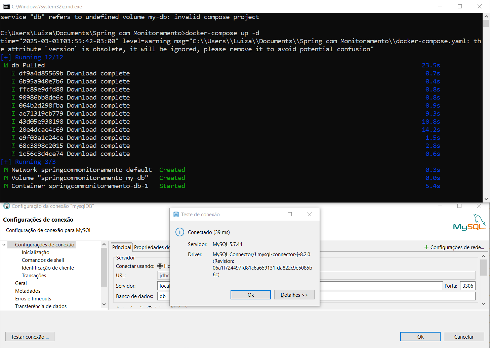
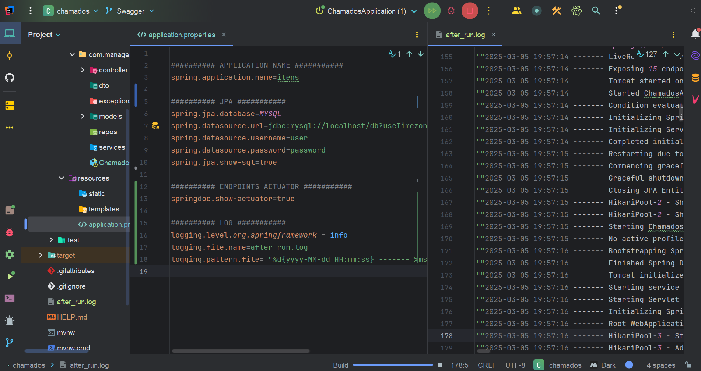
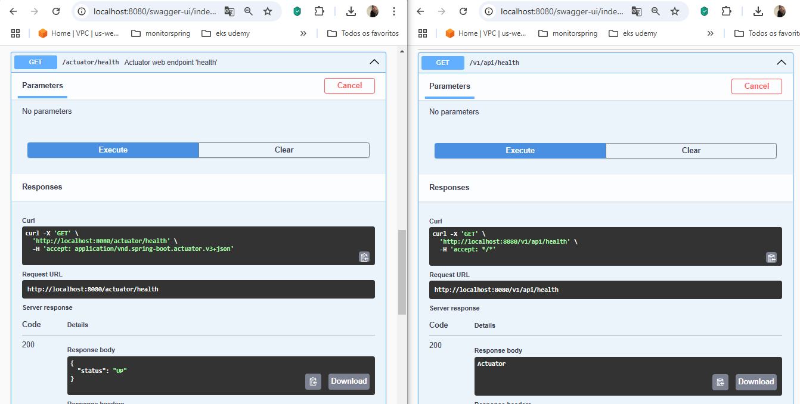

  
# Microservices com monitoramento de performance de cada API

## 🔗 Links  ➡️ 
[](https://br.linkedin.com/in/luiza-andrade-ti/)  

[](https://github.com/luizaandradeti/) 
 

## Tech Stack 🔨
**Client:** Any: Thunder Client, Curl, Swagger 

**Backend softwares:** Java 17, IntelliJ, VsCode, Docker , DBeaver

# Get Started 🚀  
To get started... Follow the steps in the flow

## Table of contents 🖥️
1. [Run docker-compose MySQL](#run-docker-compose-mysql-in-git-bash)
2. [Create a spring project](#add-actuator-and-run)
  
## Run Docker Compose MySQL in git bash
``` docker-compose up -d ```

  


## Create Spring Project  ⚡️
- https://start.spring.io/ 
    - Spring Web 
    - Spring Boot DevTools Developer Tools
    - MySQL Driver SQL
    - Spring Data JPA SQL

## Add actuator and run

- branch actuator
- Run application and test 

```
curl --location 'localhost:8085/v1/api/health'
```
output

```
{"status":"UP"}
```

 

## Add swagger and logs
**pom.xml**
````
        <dependency>
            <groupId>org.springdoc</groupId>
            <artifactId>springdoc-openapi-starter-webmvc-ui</artifactId>
            <version>2.8.5</version>
        </dependency>
        <!-- https://mvnrepository.com/artifact/org.springdoc/springdoc-openapi-data-rest -->
        <dependency>
            <groupId>org.springdoc</groupId>
            <artifactId>springdoc-openapi-data-rest</artifactId>
            <version>1.8.0</version>
        </dependency
````
**application.properties**
 

 
