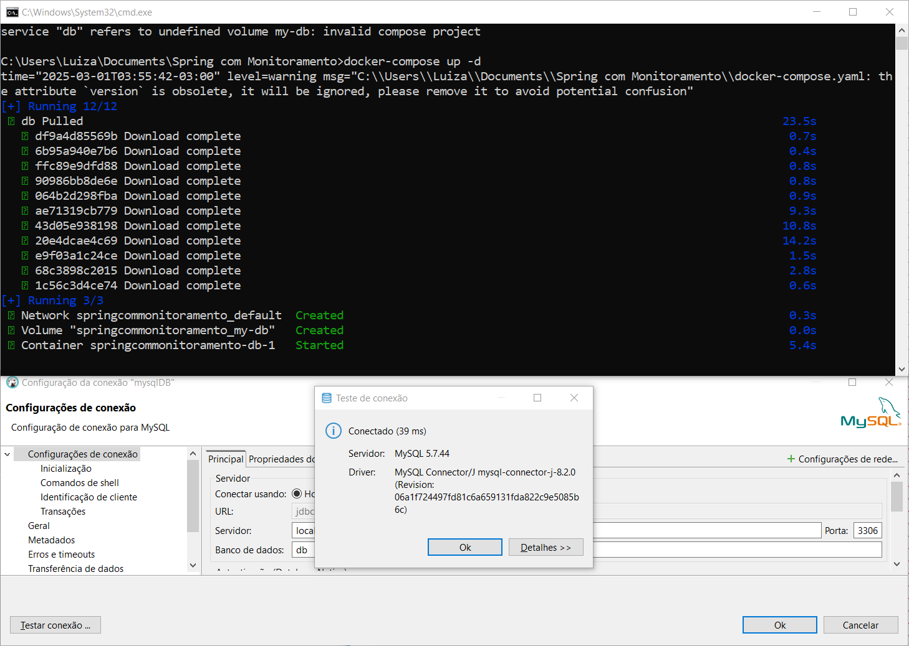

  
# Microservices com monitoramento de performance de cada API

## 🔗 Links  

[](https://br.linkedin.com/in/luiza-andrade-ti/)  

[](https://github.com/luizaandradeti/) 
 

## Tech Stack  
**Client:** Any: Thunder Client, Curl, Swagger 

**Backend softwares:** Java 17, IntelliJ, VsCode, Docker , DBeaver

# Table of contents  
1. [Run docker-compose MySQL](#docker)  
2. [Create a spring project](#spring)  


## Get Started 🚀  
To get started... Follow the steps in the flow
  
## Run Docker Compose MySQL in git bash
``` docker-compose up -d ```

  

## Start Spring Project ⚡️
- https://start.spring.io/ 
    - Spring Web 
    - Spring Boot DevTools Developer Tools
    - MySQL Driver SQL
    - Spring Data JPA SQL
"# microservices-with-monitoring-spring" 
